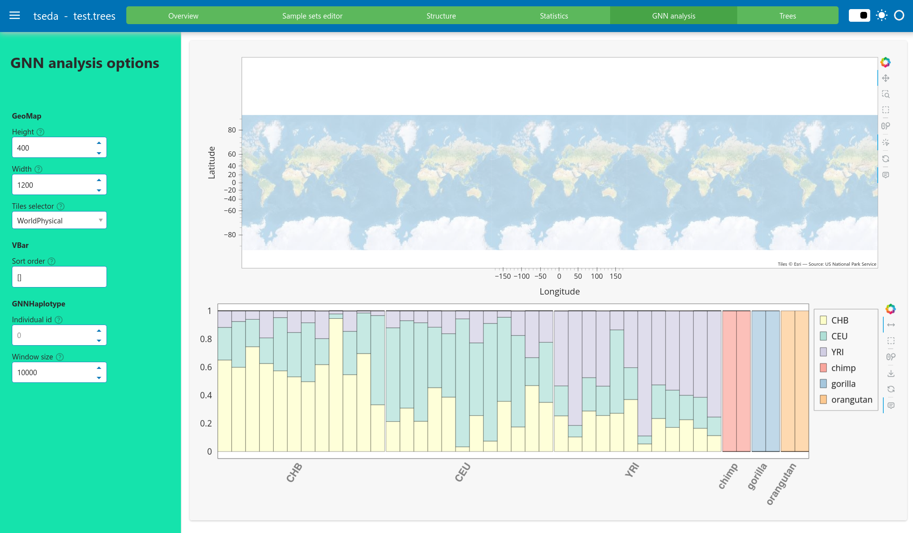

# tseda

Tree Sequence Exploratory Data Analysis. Currently builds on code base
in [tsbrowse](https://github.com/tskit-dev/tsbrowse) and retains some
of the functionality. tseda adds functionality to view the spatial
distribution of population data and connect that information to the
genetic structure of the populations.

The input trees file must be tszipped and preprocessed into a
`tsbrowse` file. Given a trees file `data.trees` the following
commands perform compression and preprocessing of the file

`tszip data.trees`
`python -m tseda preprocess data.trees.tsz`

to produce the output `data.trees.tseda`. To launch the web app run

`python -m tseda serve data.trees.tseda`

|  |
|:--:|
| Screenshot of the prototype GNN viewer |

## Installation

tseda is currently in development. To install the latest dev version
from github, run

```
python -m pip install git+https://github.com/tforest/tseda
```

## Features (WIP)

- sample set editor to customize sample set definitions, names and
  colors
- summary statistics (Fst, genealogical nearest neighbours (GNN))
  compared and averaged over sample sets
- genealogical nearest neighbour (GNN) analyses of samples
- plots of common summary statistics over sequence length (diversity,
  Tajimas_D, divergence, Fst)
- marginal tree plots
- pairwise coalescence plots

## Tests

The package comes with test data files corresponding to an
uncompressed trees file (`test.trees`), a tszipped trees file
(`test.trees.tsz`), and two tseda files (`test.trees.tseda` and
time-calibrated `test.trees.tsdate.tseda`) residing in `tests/data`.
To try out the web app, load the file `tests/data/test.trees.tseda` as
described above.
