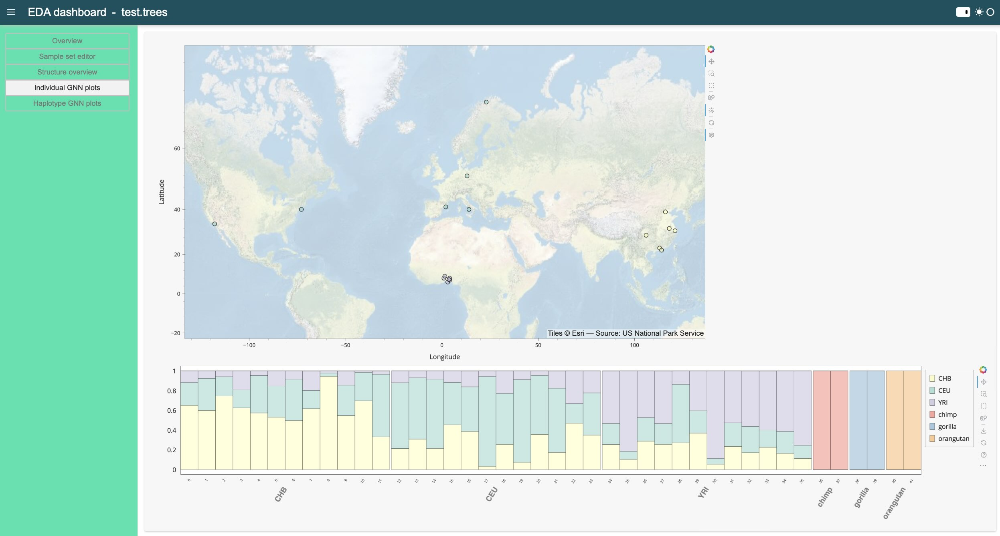

# tseda

Tree Sequence Exploratory Data Analysis. Currently builds on code base
in [tsqc](https://github.com/tskit-dev/tsqc) and retains some of the
functionality. tseda adds functionality to view the spatial
distribution of population data and connect that information to the
genetic structure of the populations.

To launch the app use:

`python -m tseda /path/to/trees-file`


|  |
|:--:| 
| Screenshot of the prototype GNN viewer |

## Installation

Tseda is currently in development. To install the latest dev version from github, run

```
python -m pip install git+https://github.com/percyfal/tseda
```

## Tests

The package comes with a test data file residing in
`tests/data/test.trees`. To try it out, clone the repo, install and
load the file.
